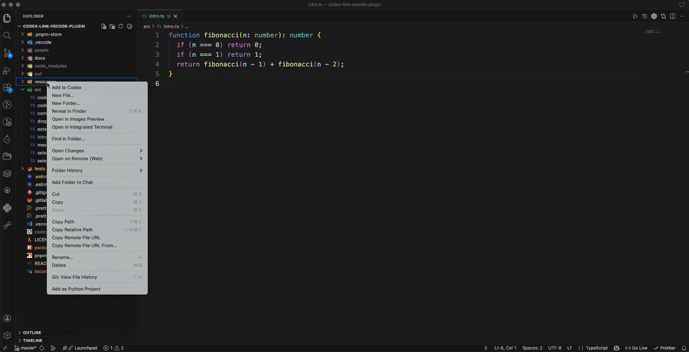

# Codex Link

Codex Link is a VS Code extension that makes it easier to send selections, files, and folders into the official `Codex - OpenAI's coding agent` extension.

It does not replace Codex chat. It adds faster entry points on top of the official Codex extension so you can move context into Codex with fewer steps.

Source repository: [github.com/lcwlucky/codex-link-vscode-plugin](https://github.com/lcwlucky/codex-link-vscode-plugin)



## What This Extension Does

Codex Link adds these entry points:

- An `Add to Chat` CodeLens above the selected range
- An editor title action named `Add to Codex`
- Explorer context menu actions named `Add to Codex` for files and folders
- A dedicated `Codex Link` sidebar with:
  - `Open Codex`
  - `Add Current File to Codex`
  - `Pick Files or Folder for Codex`
- a sidebar action for reliably picking files or folders for Codex
- a drop zone for best-effort drag and drop when your VS Code environment supports it

Behind the scenes, Codex Link delegates to the public commands exposed by the official Codex extension:

- `chatgpt.addToThread`
- `chatgpt.addFileToThread`

## Requirements

You must install and enable the official Codex extension first:

- `Codex - OpenAI's coding agent`
- extension id: `openai.chatgpt`

Codex Link depends on that extension. If it is missing or disabled, Codex Link will show an install or enable prompt instead of sending content.

## Installation

There are two common ways to install Codex Link.

### Option 1: Install from VS Code Marketplace

1. Open VS Code.
2. Open the Extensions view.
3. Search for `Codex Link`.
4. Click `Install`.
5. Make sure the official `Codex - OpenAI's coding agent` extension is also installed and enabled.

### Option 2: Install from a `.vsix` file

1. Open VS Code.
2. Open the Extensions view.
3. Click the `...` menu in the top-right corner of the Extensions view.
4. Choose `Install from VSIX...`.
5. Select the `.vsix` package for Codex Link.
6. Reload VS Code if prompted.

## Quick Start

After both Codex Link and the official Codex extension are installed:

1. Open a local project folder in VS Code.
2. Open a local file.
3. Select a block of code.
4. Click `Add to Codex`.
5. Codex should open and receive the selected context.

If you prefer not to select text manually, use the file, folder, or sidebar actions described below.

## Detailed Usage Guide

### 1. Send a selected code block to Codex

Use this when you want to send only part of a file.

Default shortcut:

- macOS: `Cmd+Option+L`
- Windows / Linux: `Ctrl+Alt+L`

You can change this shortcut in VS Code Keyboard Shortcuts. The inline CodeLens keeps showing the default shortcut text and does not dynamically reflect user-customized keybindings.

Steps:

1. Open a local file, an untitled scratch file, or a VS Code JSON settings editor.
2. Select a single contiguous block of text.
3. Look for the `Add to Chat` CodeLens above the selection.
4. Click it, or use the `Cmd+Option+L` / `Ctrl+Alt+L` shortcut.

What happens:

- Codex Link calls the official Codex selection command
- Codex receives the selected file range as thread context

Notes:

- This works in local `file` documents, `untitled` documents, and VS Code JSON settings editors such as `settings.json`
- This action supports one non-empty selection at a time
- If you have multiple selections, Codex Link will reject the action
- To reduce flicker during word-level search/navigation, single-line selections without whitespace only show `Add to Chat` when their trimmed length is at least `50` characters by default

Selection visibility setting:

Add this to `settings.json` if you want shorter or longer single-line expressions to trigger the inline actions:

```json
{
  "codexLink.minSingleLineSelectionLength": 12
}
```

This setting only affects single-line selections without whitespace. Multi-line selections and single-line selections that already contain whitespace still always show the action.

### 2. Send the current file from the editor title bar

Use this when you already have a file open and want a persistent button without selecting text.

Steps:

1. Open a local file.
2. Look at the editor title bar.
3. Click `Add to Codex`.

What happens:

- Codex Link sends the current file to Codex using the official file command

### 3. Send a file from the Explorer

Use this when you want to add a whole file from the file tree.

Steps:

1. Open the Explorer view.
2. Right-click a file.
3. Click `Add to Codex`.

What happens:

- Codex Link sends that file path to Codex

### 4. Send a folder from the Explorer

Use this when you want Codex to know about a folder without expanding every file manually.

Steps:

1. Open the Explorer view.
2. Right-click a folder.
3. Click `Add to Codex`.

What happens:

- Codex Link sends the folder path to Codex
- Codex Link does not enumerate folder contents itself
- Codex can then read from that folder on demand

### 5. Use the `Codex Link` sidebar

The sidebar is useful when you want a dedicated handoff panel.

How to open it:

1. Look at the left Activity Bar in VS Code.
2. Click the `Codex Link` icon.

The sidebar contains four main actions.

#### `Open Codex`

Use this when you just want to focus the official Codex sidebar.

#### `Add Current File to Codex`

Use this when the active editor already contains the file you want to send.

Steps:

1. Open a local file.
2. Open the `Codex Link` sidebar.
3. Click `Add Current File to Codex`.

#### `Pick Files or Folder for Codex`

Use this when you want to add files or folders through the OS file picker.

Steps:

1. Open the `Codex Link` sidebar.
2. Click `Pick Files or Folder for Codex`.
3. Select one or more files or folders.
4. Confirm the picker dialog.

What happens:

- Codex Link sends each selected resource to Codex
- Codex Link then opens the Codex sidebar

#### Drag and drop into the sidebar

Use this only if drag and drop from the VS Code Explorer works in your environment.

Steps:

1. Open the `Codex Link` sidebar.
2. Drag a file or folder from the VS Code Explorer.
3. Drop it into the drop zone.

Important limitation:

- Drag and drop support is best-effort
- VS Code Explorer drag and drop may not provide usable data to the webview in some environments
- External OS drag and drop may vary by platform and VS Code behavior

Recommended fallback:

- Use `Pick Files or Folder for Codex`

## What Happens When Codex Is Missing

If the official Codex extension is not installed:

- Codex Link shows an error message
- Codex Link offers an `Install Codex` action

If the official Codex extension is installed but disabled:

- Codex Link shows an error message asking you to enable it

## Current Limitations

- Only local `file` resources are supported
- Only a single non-empty text selection shows the `Add to Chat` CodeLens
- Selection handoff supports local files, untitled editors, and VS Code JSON settings editors
- Folder contents are not expanded by Codex Link itself
- Drag and drop is best-effort and is not guaranteed to work identically across all VS Code environments
- Codex Link cannot inject custom UI into the official Codex chat input itself

## Troubleshooting

### I clicked `Add to Codex`, but nothing happened

Check these items:

1. Confirm the official `openai.chatgpt` extension is installed
2. Confirm that extension is enabled
3. Confirm you are working in a supported editor such as a local file, an untitled document, or a VS Code JSON settings editor
4. Try `Open Codex` from the Codex Link sidebar
5. Try reloading the VS Code window

### The inline selection action does not appear

Check these items:

1. Make sure the file is a local file
2. For JSON settings files, make sure you are editing the text document itself, not the Settings UI
3. Make sure the selection is not empty
4. Make sure you only have one selection range
5. Try changing the selection once more to refresh the CodeLens

### Drag and drop into the sidebar does not work

Try this:

1. Drag from the VS Code Explorer instead of the OS file manager
2. Use `Pick Files or Folder for Codex`, which is the recommended reliable path

### I only see install prompts

That means Codex Link can run, but the official Codex extension is missing or disabled. Install or enable `openai.chatgpt` first.

## Manual Verification Checklist

Use this checklist before packaging or publishing:

1. Install and enable the official `openai.chatgpt` extension.
2. Open a local file.
3. Select a single contiguous range and confirm the `Add to Chat` CodeLens appears above the selection.
4. Click the CodeLens and confirm Codex receives the selected range.
5. Confirm the editor title action `Add to Codex` appears.
6. Right-click a file in Explorer and confirm `Add to Codex` appears and works.
7. Right-click a folder in Explorer and confirm `Add to Codex` appears and adds only the folder path context.
8. Open the `Codex Link` sidebar and test:
   - `Open Codex`
   - `Add Current File to Codex`
   - `Pick Files or Folder for Codex`
   - drag and drop from the VS Code Explorer if your environment supports it
9. Disable or uninstall `openai.chatgpt` and confirm install guidance appears.

## Internal Command IDs

These command ids are stable inside this project:

- `codexBridge.addSelectionToChat`
- `codexBridge.addResourceToChat`
- `codexBridge.installCodexDependency`
- `codexBridge.openCodex`
- `codexBridge.addCurrentFileToChat`
- `codexBridge.pickFilesOrFoldersToChat`
